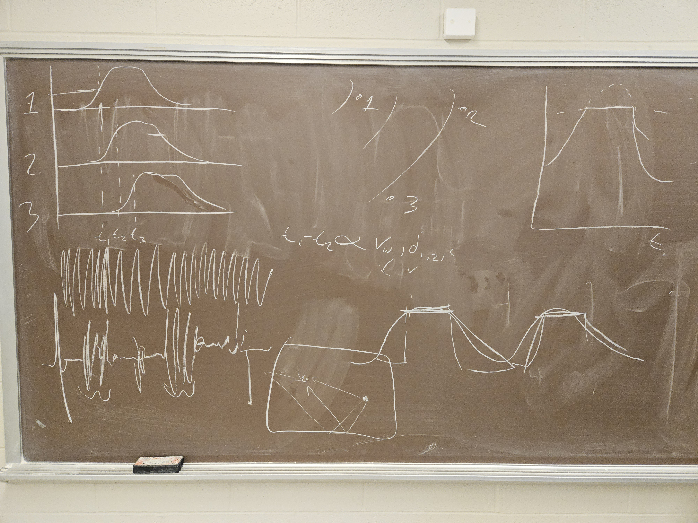

- Hydrophone Wave
	- Square Wave with High Frequency signal
	- High Frequency is carrier signal
		- 30KHz - 50
	- 5ms period, 1-3ms high
- Highly changing environment in pool
	- Random high amplitude noise
	- Random trash in between
- Circuitry cleans noise
	- Receives Information
	- 3 Identical circuits to keep phase
	- Filter w/ Circuits
		- This will mostly remove random noise outside of 30KHz - 50
- Variable Amplification on Hardware to limit clipping due to over amplification
- Rectifier smoothes it out
	- This gives a smooth raising signal back
	- Different rise and fall speeds
	- Rise is faster, back is slower & sloped
- 3 Inputs 15MGhz for DAC to convert this smoothes signal
- 3 Separate Sensors on the furthest section of the robot
	- These sensors get different phases which are proportional to distance and speed of sound in water
	- Theoretically first is closest but there is a more mathematical way
		- t1 - t2 proportional to vw, d1-2, dp-1, dp
		- 3 sets of this gives exacting radii for triangulation
		- Purely off of speed of sound, speed of light eliminated by clever
- Where are the hydrophones placed and what is the difference in time between them given water temperature and atmosphere
- PI -> (using UART) STM F32 Chip (Python)
	- We can choose how much work we want to offload to the STM
	- Especially if using high 16MGhz
- Motors and Movement both mess with measurements
	- Have to keep still and low motors to keep noise minimal
- What does the computer do
	- Sense when overclipping and report
	- Get how long it takes for the ideal smoothed curve to raise and how to threshold it
		- Get overall time "high" and measure the center of the signal
		- Ultimately trying to derive a square wave back out of the noisy waves